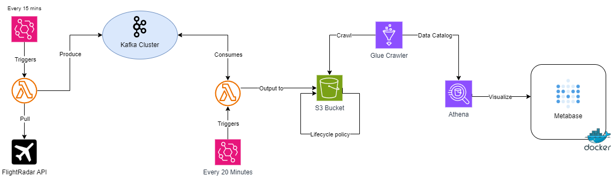
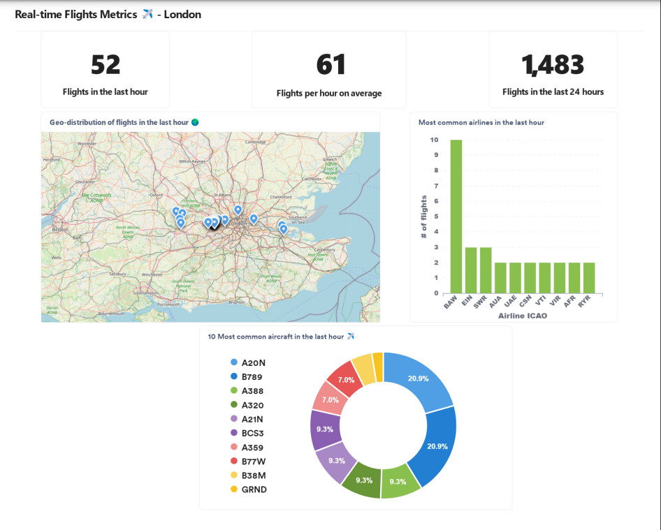

# ✈️ Flights-Metrics


<h3 align="center">Flights Metrics</h3>

  <p align="center">
    Near Real-time metrics for flights over a region.
    <br/>
    <br/>
    <a href="https://metabase.anniscodes.com/public/dashboard/a4247cfe-df70-4dde-8070-538eba35fd84"><strong>Visit the Dashboard »</strong></a>
    <br/>


Flights Metrics is a data pipeline that aims to provide hourly analytics on flights over a city or a region (London is the default configuration). The pipeline is built in Python and deployed on several AWS services: Lambda, S3, Glue and Athena. 

## Preview




## Architecture

The project is deployed fully only on AWS, except for the Kafka broker which is hosted on the free tier of Upstash. Metabase is deployed on Amazon Lightsail as a Docker container. Flights are fetched every 15 minutes with a Lambda function and consumed every hour by another Lambda function, Apache Kafka serves both as a streaming layer and a buffer in this case. 

The consumer creates partitions in Athena (see note) and the Metabase dashboard performs different SQL queries to retrieve the metrics data from Athena. Data is kept for 3 days in S3 and then it's automatically deleted through an S3 lifecycle policy to reduce costs.



**Note:** The old architecture was using Glue to automate the process of adding new partitions from S3 to Athena, however, this approach was expensive and we developed a new method in `stream/S3Consumer.py` to add partitions to S3 directly using an Athena query, this reduces costs by over **60%**!

## Setting up

To configure the projects with your preferences, you need to edit those three configuration files in the config folder:

- `aws.json`: Rename the `aws.example.json` file into `aws.json` and put the right parameters: AWS Access key, secret key, and the session key (not required).
- `env.json`: Rename the `env.example.json` file into `env.json` and put the bounding box coordinates for the region of your choice (London is the default configuration).
- `kafka.json`: Similarly, rename `kafka.example.json` to `kafka.json` and include all the required parameters for Kafka to run: bootstrap server, username, password, etc. Feel free to experiment with other options.  

## Deploying to Lamba

Currently, we have two different bash scripts to generate the zip files to be uploaded on AWS lambda: `vendor.zip` for dependencies and `package.zip` for both the producer and consumer functions.

```bash
# To package the libraries into one zip run :
bash package-deps.sh
```

```bash
# To package the app into one zip run :
bash package-deps.sh
```

## Improvements for the future

- Implement a CI/CD pipeline with GitHub Actions and AWS SAM to automate the deployment of new versions.
- Add an ETL function to convert JSON files to Parquet for more efficient analytics.
- Cache some parts of the dashboard hourly to reduce the number of requests and costs. 

